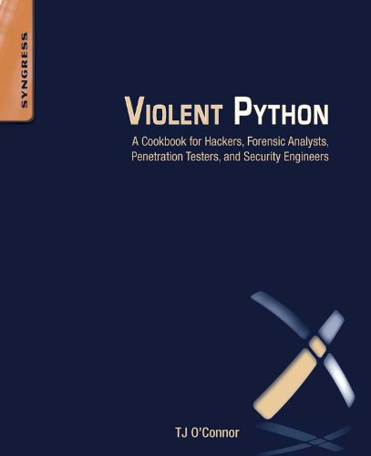

# Violent Python

## Table of Contents
- [About the Project](#about-the-project)
  * [Introduction](#introduction)
- [Getting Started](#getting-started)
  * [Prerequisites](#prerequisites)
  * [Installation](#installation)
- [Usage](#usage)
- [Roadmap](#roadmap)
- [Acknowledgements](#acknowledgements)

## About the Project
### Introduction
In this repository on will find various of the __Python Scripts__ found throughout TJ O'Connor's book: _Violent Python: A Cookbook for Hackers, Forensic Analysts, Penetration Testers and Security Engineers_. With that being said, it should be noted that, albeit, a contradiction of what has been already stated, most of the code of these scripts have been modified so as to function properly with the current version of __Python__, i.e.: _Python 3_, to be precise.

Consequently, the programs that are to be found in this repository are basic versions of _Ciphers_, _Password Crackers_ and _Botnets_, to name a few, which are to serve as some sort of reference.

All of these programs were developed throughout __Summer 2020__.
## Getting Started
### Prerequisites
As per the instructions found in the book and the current state of the code, the following list illustrates the necesary dependencies of all of these programs:
- [Python 3](https://www.python.org/downloads/)
- A Linux Machine: During the time of the development of all of these scripts, the Operative System which was used was [Kali Linux](https://www.kali.org/); however, it is believed any other Linux distribution will suffice.
  * Depending on the availabily of another computer and the user's versatily with Linux, it is advised to install the preferred Linux Distribution on a [Virtual Machine](https://www.virtualbox.org/). More information on how to do this can be found [here](https://itsfoss.com/install-linux-in-virtualbox/).
- Violent Python: A Cookbook for Hackers, Forensic Analysts, Penetration Testers and Security Engineers (It may not be necessary, but recommended.)
### Installation
Depending on the form of availabilty of the Linux Machine, one would have to either download the contents of this repository on a computer or Virtual Machine. After that is done, just run the wanted script.

## Usage
Given the scope of this repository, for the time being, all information related to the usage of such scripts will be found by either using them or their respective comments. Furthemore, it should be noted that when all of these scripts were tested back in __2020__, they were assesed against the Linux Machine by lack of computing resources.

## Roadmap
* [x] Move all files to a Github Repository.
* [ ] Verify that all of the programs still work for the current version of Python.
  - [ ] Verify Botnet
  - [x] Verify Crypt
  - [ ] Verify FTP
  - [ ] Verify Nmap
  - [ ] Verify SSH
  - [X] Verify TCP
  - [x] Verify Zipfile
* [ ] Comment on all uncommented files.
  - [ ] Comment BOTNET
  - [x] Comment Crypt
  - [ ] Comment FTP
  - [ ] Comment Nmap
  - [ ] Comment SSH
  - [ ] Comment TCP
  - [x] Comment Zipfile
* [ ] Reread TJ O'Connor's book to verify if all of the programs are present in one form or another in the repository.
  - [X] Find if more programs need to be created. (YES)

## Acknowledgements
- [Place to buy the book.](https://www.amazon.com/Violent-Python-Cookbook-Penetration-Engineers/dp/1597499579)
- [Place to look for new versions of the scripts presented on the book.](https://github.com/)
- [Where the logo was found.](https://lh5.googleusercontent.com/nLrYjHzvi84zM0uAri7p_EPrc93M9Y2YXJQOcf7JEN1MKnlFc3BH8285VPYLGfQhyCc=w1200-h630-p)
